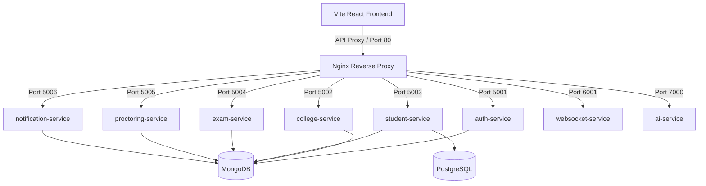

# OmniProctor.ai — Enterprise Microservices Architecture & Verification Report

This document reviews the complete architectural rebuild of the AI-Powered Online Assessment & Intelligent Proctoring Platform into a distributed, isolated microservices ecosystem.

---

## 1. System Architecture Layout

The platform has been reorganized from a monolithic backend into 9 isolated application microservices and 3 infrastructure services, all managed via Docker Compose.

### Microservices Definitions & Roles
1.  **frontend-service** (Vite + React + Nginx): Serves static files and routes all internal endpoints through reverse proxy mappings.
2.  **auth-service** (Express, Port 5001): Handles JWT logins, token refreshes, student registrations, and verification OTP generation.
3.  **college-service** (Express, Port 5002): Manages institution onboarding (Super Admin level), code validations, and college status toggles.
4.  **student-service** (Express, Port 5003): Handles student search profiles, roster deactivations, administrative password resets, and bulk CSV uploads.
5.  **exam-service** (Express, Port 5004): Schedules assessments, manages question banks, restricts candidates via branch/year filters, and scores submissions.
6.  **proctoring-service** (Express, Port 5005): Registers telemetry violations and saves webcam snapshot files to persistent shared volumes.
7.  **notification-service** (Express, Port 5006): Manages user inbox notices, collects administrative logs, and serves email outbox histories with retry triggers.
8.  **websocket-service** (Node, Port 6001): Broadcaster managing realtime WebSocket alerts.
9.  **ai-service** (Express, Port 7000): Simulates YOLOv8 cell phone detection, InsightFace checkins, and Mistral/Phi-3 MCQ generations.

---

## 2. Shared Data Persistence & DB Fallback System

All Node microservices are configured with a dual-database design:
*   **Production MongoDB Connectors**: If MongoDB is active, containers use standard database collections schema-lessly.
*   **JSON-FS Fallback Engine**: If MongoDB is offline, services persist data into a shared volume mapped to `./database/data/*.json`. This ensures zero startup crashes and lets the developer run the app locally without database dependencies.
*   **PostgreSQL Relational Container**: Mapped in Compose on port 5432 with volume persistence.

---

## 3. Secure Gmail Outbox Queue

*   **Configured SMTP Server**: Direct integration using Google's SMTP servers (`smtp.gmail.com` on port `587`).
*   **Observed Email Logs**: The notification service records all sent and failed messages inside a unified database collection.
*   **Manual Retries**: Admins can inspect mail outbox errors in the console dashboard and trigger immediate Nodemailer retries.

---

## 4. Roster Import Pipeline

*   **Excel/CSV Imports**: Handled via `student-service` using memory-buffered parsing.
*   **Validation Rules**: Automatically checks for branch (e.g. CSE/ECE), year (e.g. 1st Year/2nd Year), duplicate roll numbers, and duplicate emails in both the database and the uploaded CSV.
*   **Temporary Accounts**: Automatically creates students as pre-verified and active, generates temporary passwords, and dispatches credential notices.

---

## 5. Verification Guide

1.  **Orchestrating**: Spin up all containers by running `docker compose up --build`.
2.  **Verify Endpoints**:
    *   Auth health check: `http://localhost/api/health`
    *   AI health check: `http://localhost:7000/health`
3.  **Frontend Access**: Open `http://localhost` and log in to inspect the user interface.
